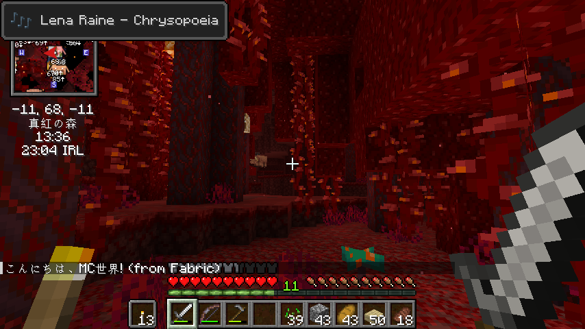
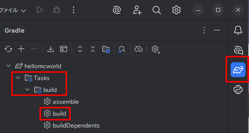
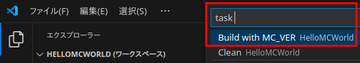

[](https://www.minecraft.net/ja-jp/store/minecraft-java-bedrock-edition-pc) [](https://fabricmc.net/) [](https://files.minecraftforge.net/net/minecraftforge/forge/) [](https://neoforged.net/) [](https://www.curseforge.com/) [](https://modrinth.com/)  

# HelloMCWorld



"Hello MC World!!" mod

ワールドログイン時に、  
"こんにちは、世界"をチャットGUIに表示するmod例です。

Fabric/Forge/NeoForge のmodローダに共通コード（Kotlin）で表示させています。

common/src/kotlin/.../hellomcworld/HelloMCWorld.kt  
をご覧ください。

## modローダ以外に必要なmod

- Fabric
  - [Fabric API](https://modrinth.com/mod/fabric-api)
  - [Fabric Language Kotlin](https://modrinth.com/mod/fabric-language-kotlin)

## 開発環境

- [SDKMAN!](https://sdkman.io/install)
  - [OpenJDK 21.x.x](https://sdkman.io/jdks/open)
- (Windows)[Windows PowerShell](https://learn.microsoft.com/ja-jp/powershell/scripting/install/installing-powershell-on-windows)
- (補足: IDE) [IntelliJ IDEA Community Edition](https://www.jetbrains.com/ja-jp/idea/download/) or [VSCode](https://code.visualstudio.com/)

## ビルド

### Windows

#### Windows PowerShell

- ビルド

``` powershell
MC_VER=1.21.8 python python\\build.py
```

- クリーン

``` powershell
python python\\build_clean.py
```

### Linux/macOS

#### シェル

- ビルド

``` bash
MC_VER=1.21.8 python python/build.py
```

- クリーン

``` bash
python python/build_clean.py
```

### IntelliJ IDEA Community Edition



- ビルド

Gradle -> Tasks -> build -> build

- クリーン

Gradle -> Tasks -> build -> clean

### VSCode



- ビルド

task -> Build with MC_VER

- クリーン

task -> Clean

## 成果物（アーティファクト）

`fabric/forge/neoforge` の `buiild/libs` ディレクトリに、  
`hellomcworld-x.x.x.jar`  
が生成されるので、マインクラフトの `mods` ディレクトリに入れて下さい。

# 寄付のお願い！

[](https://coff.ee/azo234) ☕💚

[](https://github.com/sponsors/azo234) 💎✨
